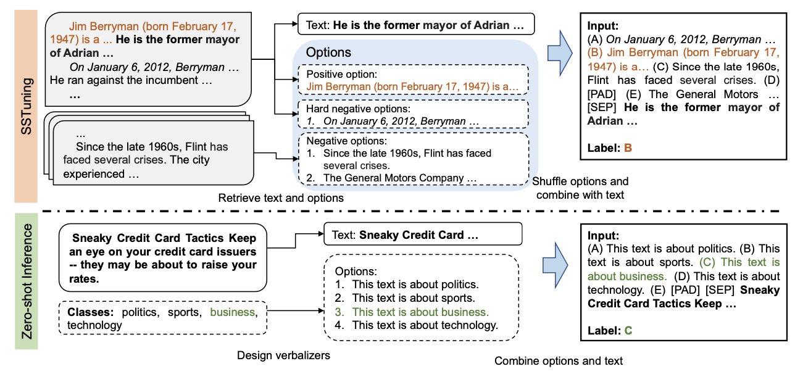

# Zero-Shot Text Classification via Self-Supervised Tuning
This repository contains the code and pre-trained models for the paper "[Zero-Shot Text Classification via Self-Supervised Tuning](https://arxiv.org/abs/2305.11442)", which was accepted to Findings of ACL 2023.

We Also used a multilingual model for zero-shot text classification, which is [zero-shot-classify-SSTuning-XLM-R](https://huggingface.co/DAMO-NLP-SG/zero-shot-classify-SSTuning-XLM-R).

## Model description
The model is tuned with unlabeled data using a learning objective called first sentence prediction (FSP). 
The FSP task is designed by considering both the nature of the unlabeled corpus and the input/output format of classification tasks. 
The training and validation sets are constructed from the unlabeled corpus using FSP. 

During tuning, BERT-like pre-trained masked language models such as RoBERTa and ALBERT are employed as the backbone, and an output layer for classification is added. 
The learning objective for FSP is to predict the index of the correct label. 
We did sentiment analysis based classification of finding postive and negatives sentences in testing dataset CSVs and checked model accuracies as well as made confusion matrix to validate it.

## Quick start for inference
You can try the Tuning of models with the Colab [Notebook](https://colab.research.google.com/drive/1PBT9Ao-mRt2VcPQOjP9UwvziR6oPcMVi?usp=sharing).
You can try the testing models with the Colab [Notebook](https://colab.research.google.com/drive/1fGu392rQpFfpLL_luEq43TUThYWrpONO?usp=sharing).

